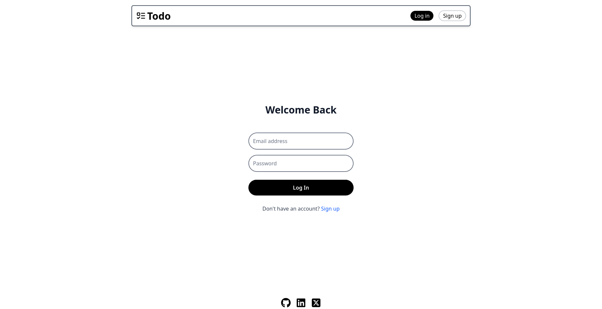
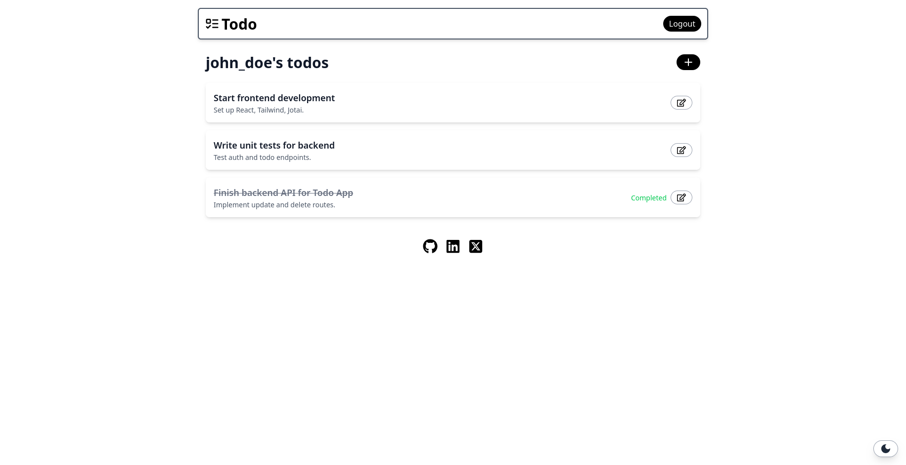

# Overengineered Todo App

A robust and feature-rich Todo application built with the MERN stack, showcasing modern web development practices including JWT authentication, Jotai for state management, Tailwind CSS for styling, and a focus on modularity and user experience.

## ✨ Features

- **User Authentication:** Secure registration and login with JSON Web Tokens (JWT).
- **CRUD Operations:** Create, Read, Update, and Delete todo items.
- **Dynamic Dashboard:** Displays user-specific todos.
- **Add Todo Modal:** Intuitive modal for creating new tasks.
- **Edit/Delete Todo Modal:** Dedicated modal for updating existing todos and marking them complete, or deleting them.
- **Persistent Data:** Todos are stored in a MongoDB database.
- **Client-Side Routing:** Seamless navigation using React Router DOM.
- **Global State Management:** Efficient state handling with Jotai.
- **Responsive Design:** Styled with Tailwind CSS for optimal viewing on various devices.
- **Theme Toggling:** Manual dark/light mode switch with preference persistence.

## 📸 Screenshots




## 🚀 Tech Stack

**Frontend:**

- **React 19:** A JavaScript library for building user interfaces.
- **Vite:** A fast build tool for modern web projects.
- **Jotai:** A primitive and flexible state management library for React.
- **Tailwind CSS 4:** A utility-first CSS framework for rapid UI development.
- **Axios:** Promise-based HTTP client for the browser and Node.js.
- **React Router DOM 7:** For client-side routing.
- **React Icons & Lucide React:** For beautiful SVG icons.

**Backend:**

- **Node.js:** JavaScript runtime.
- **Express.js:** Fast, unopinionated, minimalist web framework for Node.js.
- **MongoDB:** NoSQL database for storing todo items and user data.
- **Mongoose:** MongoDB object data modeling (ODM) for Node.js.
- **JWT (JSON Web Tokens):** For secure user authentication.
- **Bcrypt.js:** For password hashing.
- **CORS:** Middleware for enabling Cross-Origin Resource Sharing.
- **Dotenv:** For loading environment variables.

## ⚙️ Getting Started (Local Development)

Follow these steps to get the project up and running on your local machine.

### Prerequisites

- **Node.js (v18 or higher recommended):** [nodejs.org](https://nodejs.org/ "null")
- **npm** (comes with Node.js) or **Yarn**
- **MongoDB Atlas Account:** You'll need a free cluster to host your database. [cloud.mongodb.com](https://cloud.mongodb.com/ "null")

### 1. Clone the Repository

```
git clone https://github.com/akash2003git/overengineered-todo-app.git
cd overengineered-todo-app
```

### 2. Backend Setup

Navigate into the `backend` directory, install dependencies, and set up environment variables.

```
cd backend
npm install
```

Create a `.env` file in the `backend/` directory with the following content:

```
# .env for Backend
MONGO_URI="YOUR_MONGODB_ATLAS_CONNECTION_STRING"
JWT_SECRET="YOUR_SUPER_SECRET_JWT_KEY"
PORT=5000 # Optional, defaults to 5000 if not set by hosting
```

- **`MONGO_URI`**: Get this from your MongoDB Atlas cluster. Remember to set up network access to allow connections from your local IP (or `0.0.0.0/0` for testing, but be cautious in production).
- **`JWT_SECRET`**: A strong, random string. You can generate one online.

Run the backend server:

```
npm start # or yarn start
```

The backend server should start on `http://localhost:5000`.

### 3. Frontend Setup

Open a new terminal, navigate into the `frontend` directory, install dependencies, and set up environment variables.

```
cd ../frontend
npm install
```

Create a `.env` file in the `frontend/` directory with the following content:

```
# .env for Frontend
VITE_REACT_APP_BACKEND_BASEURL="http://localhost:5000/api"
```

Run the frontend development server:

```
npm run dev
```

The frontend application should now be running on `http://localhost:5173` (or another port if Vite chooses differently).

### 4. Access the Application

Open your browser and navigate to `http://localhost:5173`. You should see the login page.
